# 테스터 사용자 매뉴얼

본 문서는 통합테스트를 수행하는 테스터가 시스템에 접속해 테스트를 진행하고, 결함 확인까지 처리하는 절차를 안내합니다.

## 1. 회원가입 및 로그인

### 1.1 메인화면

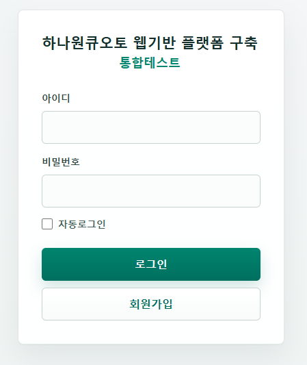

시스템에 접속하면 로그인 화면이 표시됩니다.

기존 계정이 있는 경우 아이디와 비밀번호를 입력해 로그인합니다. 계정이 없는 경우 하단의 **회원가입** 버튼을 클릭합니다.

### 1.2 회원가입

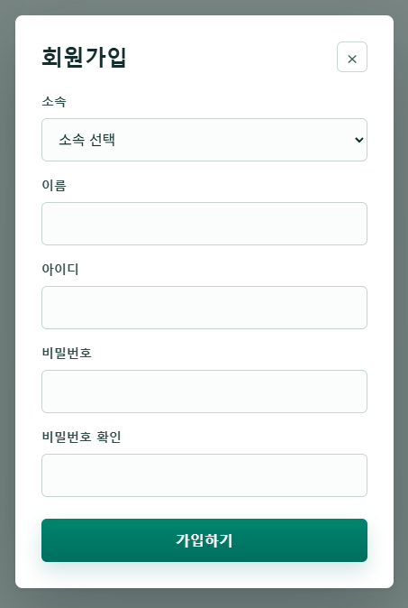

회원가입 화면에서 소속, 이름, 아이디, 비밀번호, 비밀번호 확인을 입력합니다.

입력한 정보를 확인한 뒤 **가입하기** 버튼을 클릭합니다. 비밀번호와 비밀번호 확인 값이 서로 다르면 가입할 수 없습니다.

### 1.3 로그인

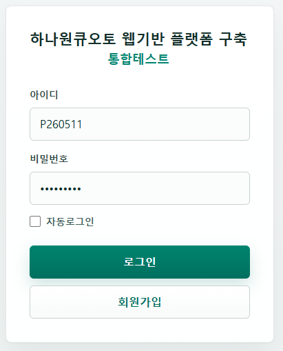

가입한 아이디와 비밀번호를 입력한 뒤 **로그인** 버튼을 클릭합니다.

자주 사용하는 PC에서는 필요에 따라 **자동로그인**을 선택할 수 있습니다. 공용 PC에서는 자동로그인을 사용하지 않는 것을 권장합니다.

로그인이 완료되면 테스터 권한에 맞는 대시보드 또는 테스트 화면으로 이동합니다.

## 2. 테스트 수행

### 2.1 테스트 메뉴 진입

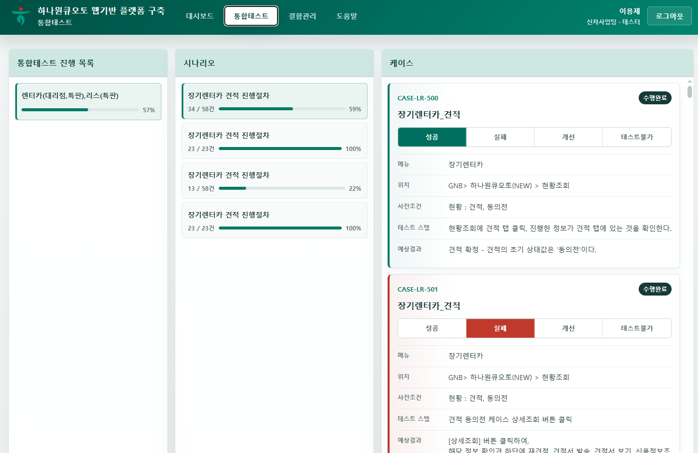

상단 메뉴에서 **통합테스트**를 클릭합니다. 테스트 수행 화면에서는 테스트 차수, 시나리오, 테스트 케이스를 순서대로 선택해 결과를 등록합니다.

### 2.2 테스트 케이스 선택

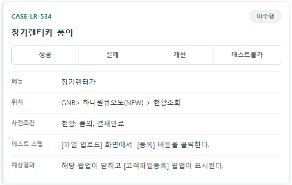

왼쪽 영역에서 테스트 차수와 시나리오를 선택합니다. 선택한 시나리오에 포함된 테스트 케이스가 오른쪽에 표시됩니다.

각 테스트 케이스의 메뉴, 위치, 사전조건, 테스트 스텝, 예상결과를 확인한 뒤 실제 수행 결과를 등록합니다.

### 2.3 성공 결과 등록

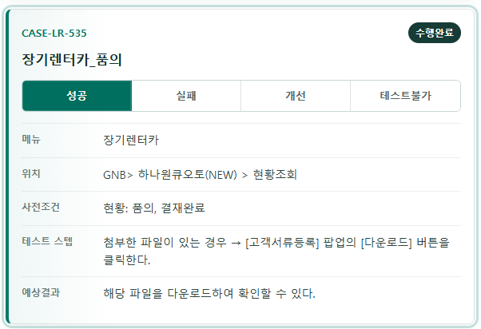

테스트 결과가 예상결과와 일치하면 해당 케이스의 **성공** 버튼을 클릭합니다.

성공으로 등록된 케이스는 진행률에 반영되며, 별도 결함 등록은 생성되지 않습니다.

### 2.4 실패 결과 및 결함 내용 등록

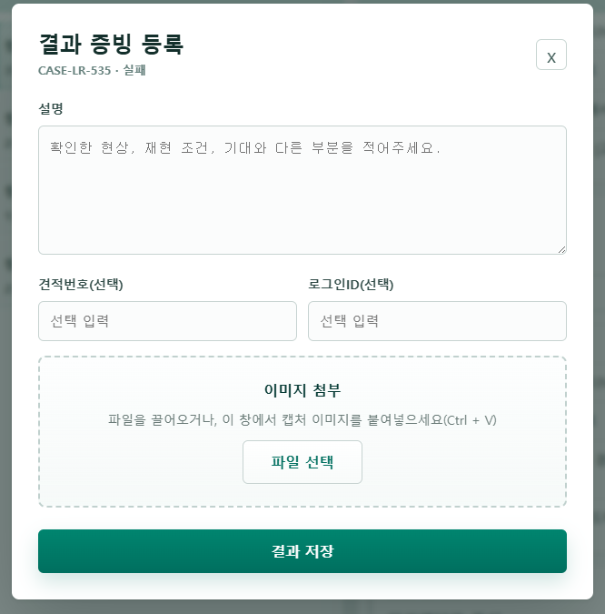

테스트 결과가 예상결과와 다르면 **실패** 버튼을 클릭합니다. 개선 요청이 필요한 경우에는 **개선**을, 테스트를 수행할 수 없는 경우에는 **테스트불가**를 선택합니다.

결과 증빙 등록 창에서 현상 설명, 견적번호, 대상 로그인 ID를 입력하고 필요한 이미지를 첨부한 뒤 결과를 저장합니다.

### 2.5 접수된 실패 건 확인

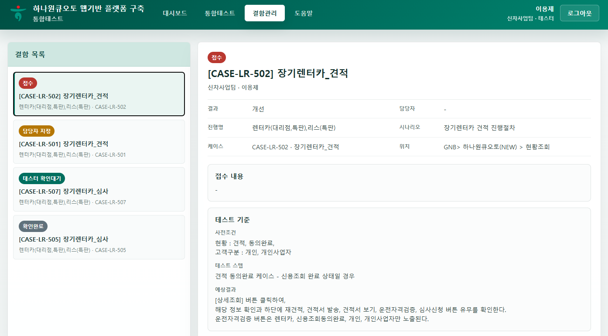

실패, 개선, 테스트불가로 저장한 결과는 결함으로 접수됩니다. 상단 메뉴의 **결함관리**에서 접수된 결함을 확인할 수 있습니다.

결함 목록에서 항목을 선택하면 테스트 케이스 정보, 등록한 설명, 증빙 이미지를 확인할 수 있습니다.

## 3. 결함확인 단계

### 3.1 대시보드에서 확인 대상 찾기

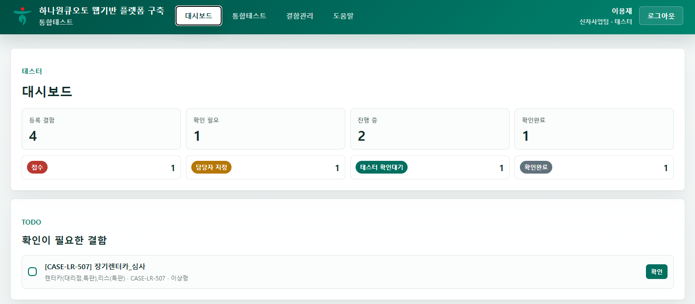

대시보드에서 등록 결함 현황과 TODO 목록을 확인합니다. 확인이 필요한 결함은 TODO 목록에서 바로 선택할 수 있습니다.

또는 상단 메뉴의 **결함관리**로 이동해 등록한 결함의 진행상태를 확인합니다.

### 3.2 테스터 확인대기 결함 확인

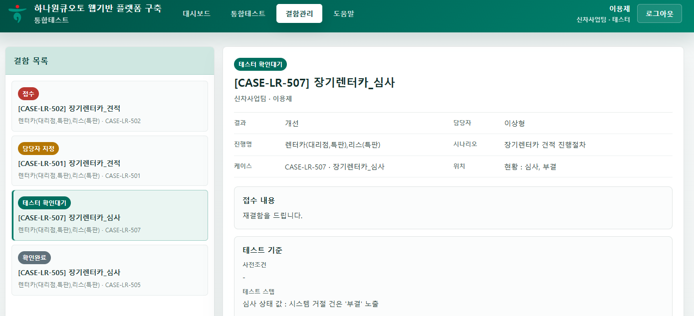

상태가 **테스터 확인대기**인 결함을 선택합니다. 상세 화면에서 처리 담당자가 입력한 조치 내용과 조치결과 이미지를 확인합니다.

### 3.3 확인완료 또는 재결함 등록 선택

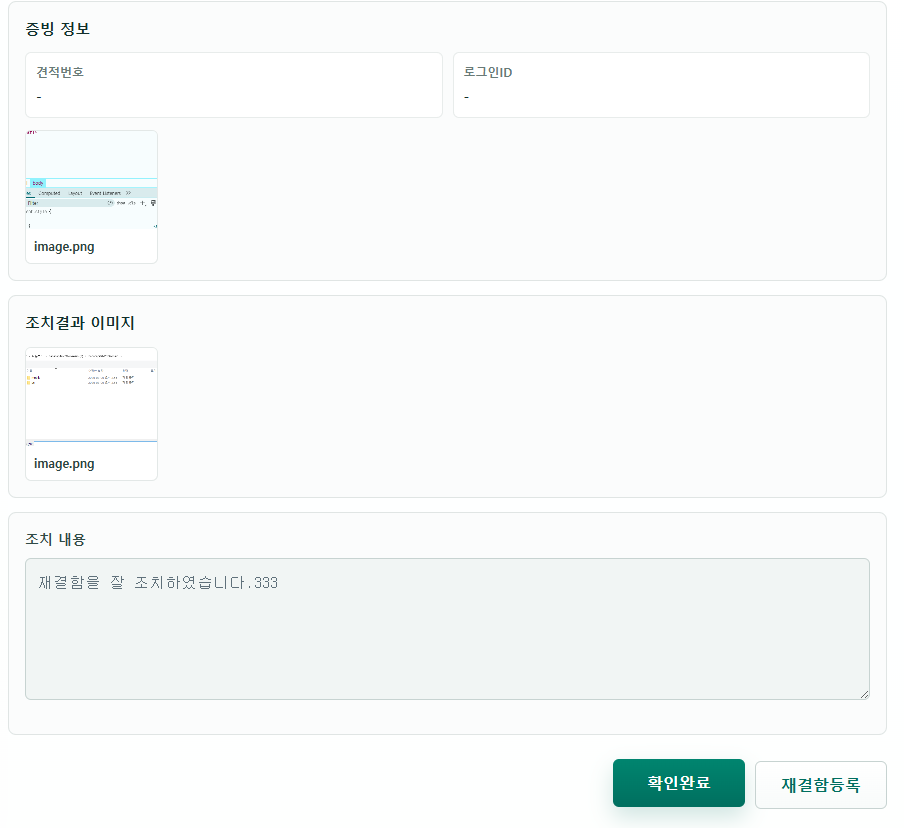

조치 내용 확인 후 문제가 해결되었으면 **확인완료**를 클릭합니다.

문제가 해결되지 않았거나 추가 확인이 필요하면 **재결함등록**을 클릭합니다.

### 3.4 재결함 내용 등록

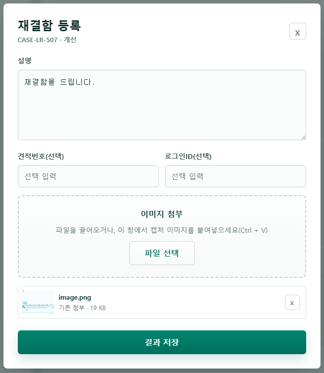

재결함 등록 화면에서 다시 확인된 현상과 필요한 설명을 입력합니다. 필요하면 캡처 이미지도 함께 첨부합니다.

등록을 완료하면 결함 티켓이 다시 처리 담당자에게 전달됩니다.
